# Construction Management System

This project is a Construction Management System that allows users to manage construction sites efficiently. It includes features to track progress, manage resources, and generate reports.

## Project Images

Below are some screenshots of the application:

  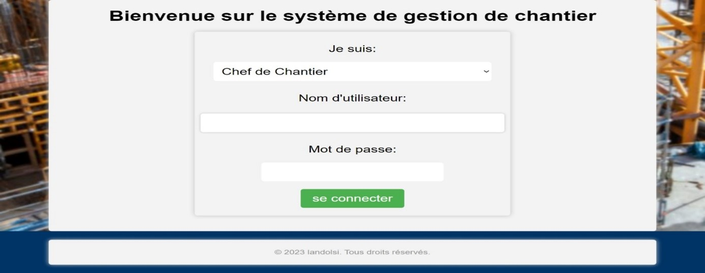
  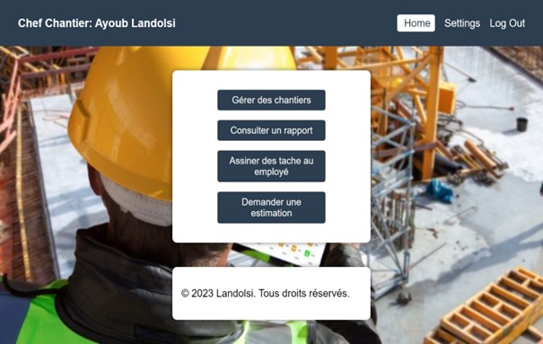
  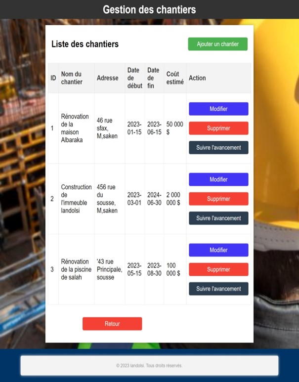

  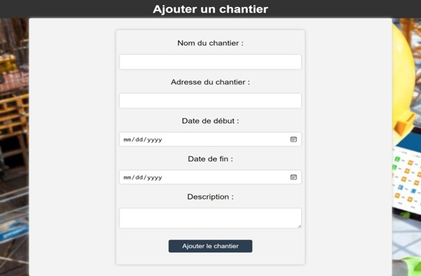
  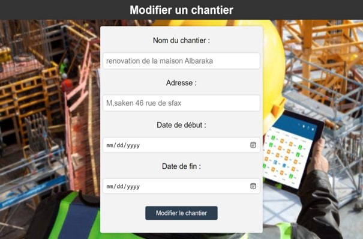
  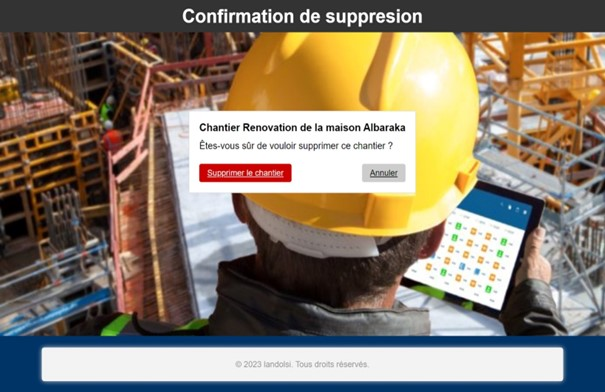

  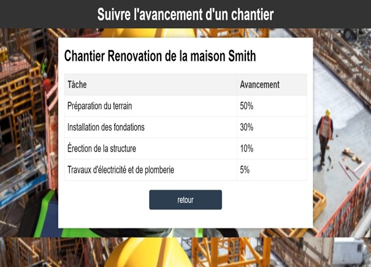
  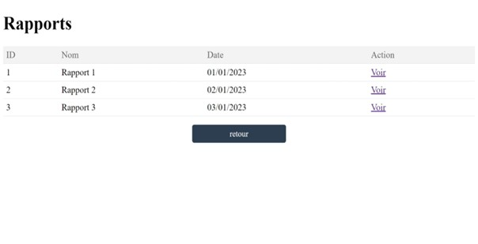
  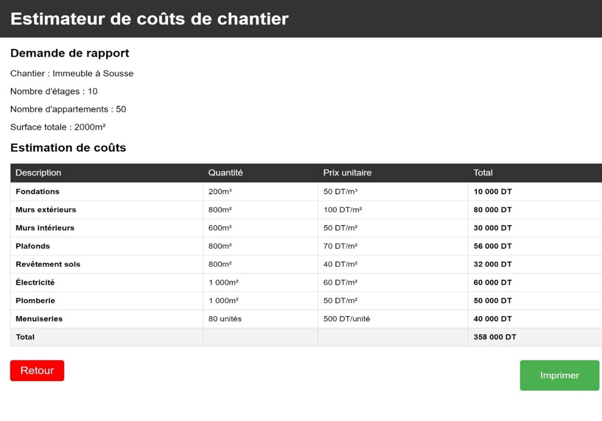

  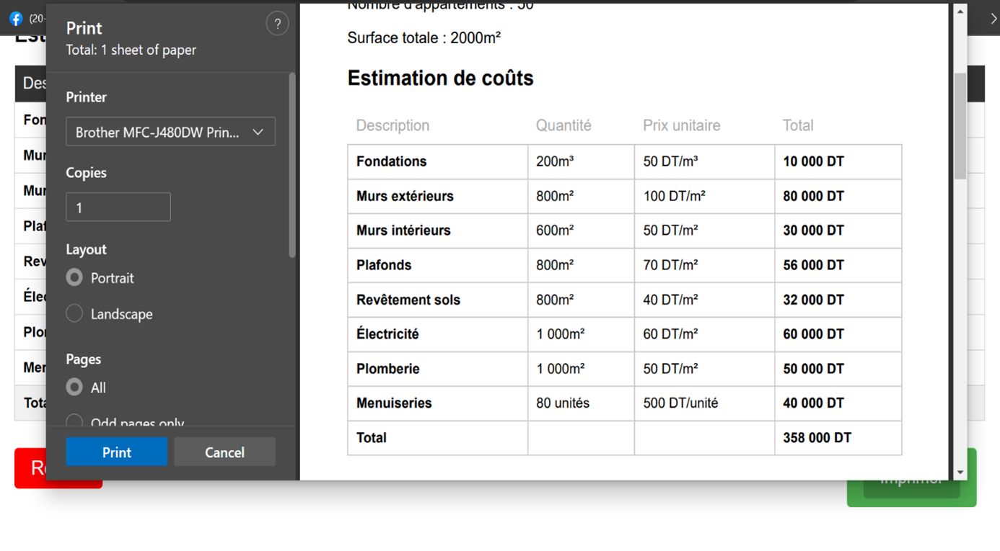
      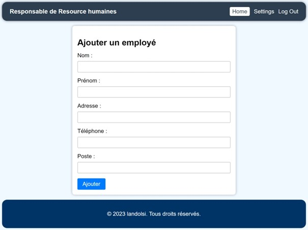
  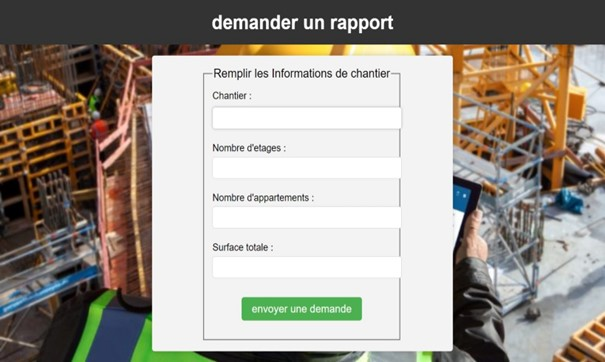

  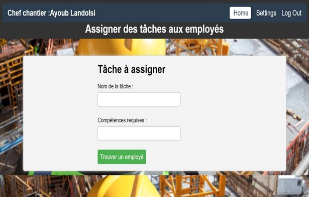
  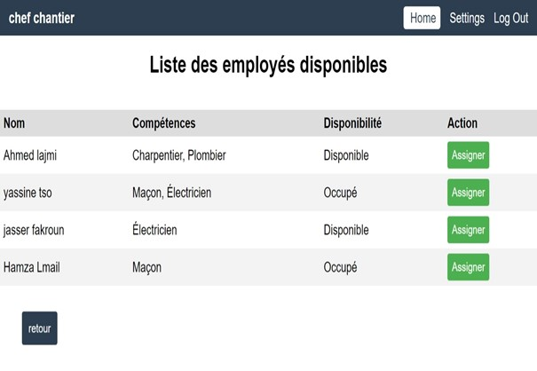
  

  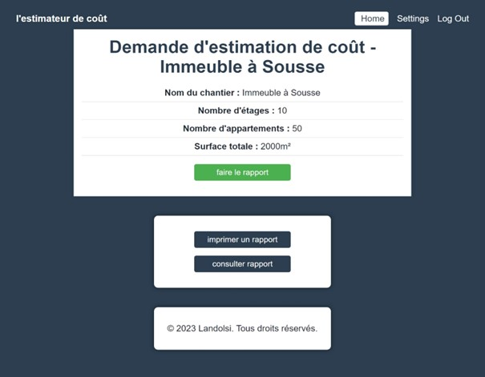
  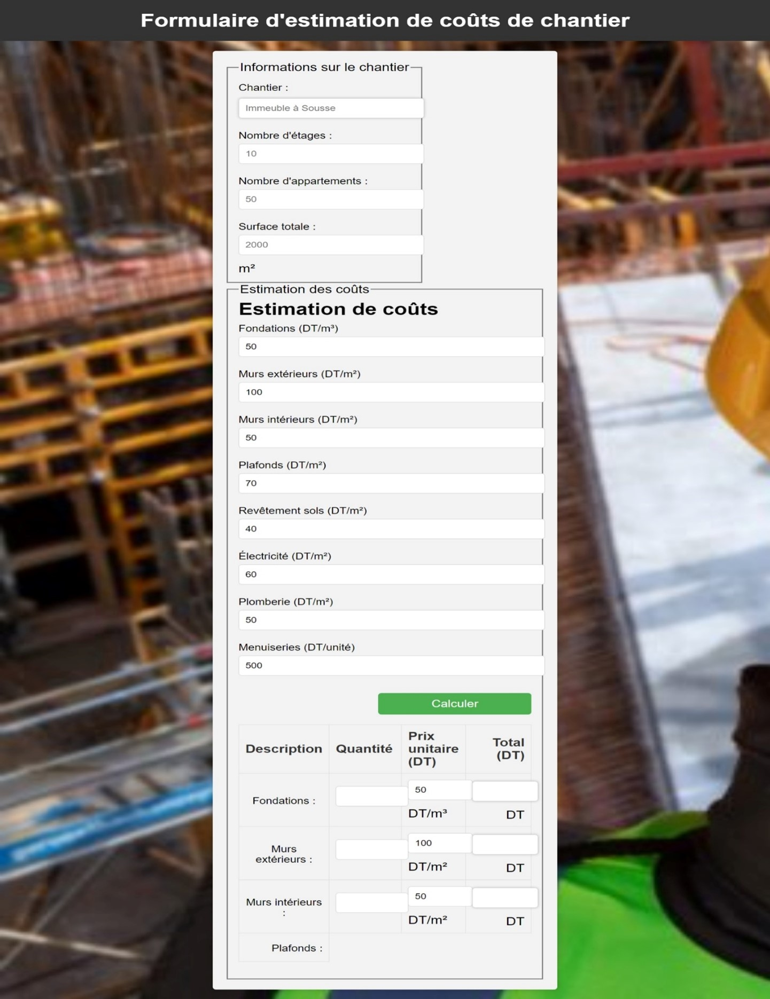
  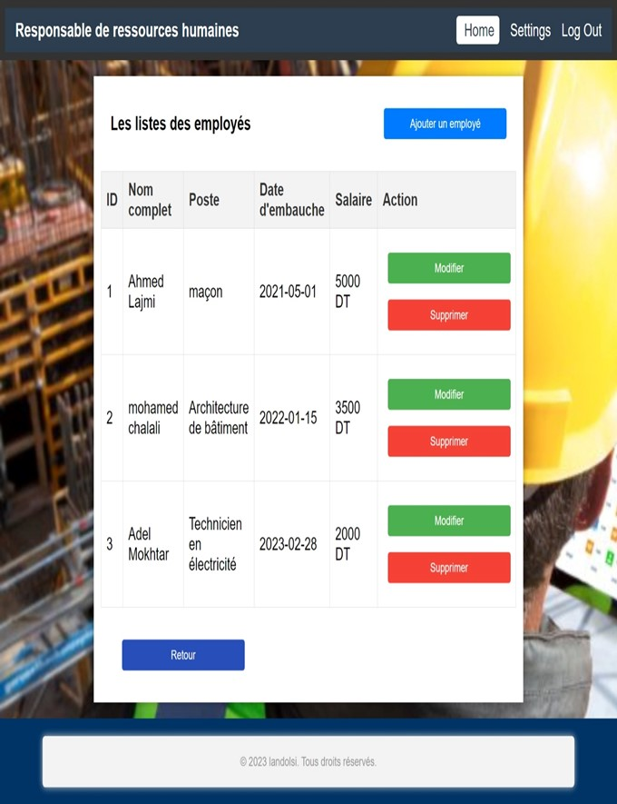

## Features

- **Authenticate** users
- **Manage construction sites**:
  - Add a new site
  - Modify an existing site
  - Delete a site
  - Track site progress
- **Human resource management**:
  - Add new employees
  - Modify employee details
  - Delete employees
- **Generate reports**:
  - Request cost estimation reports
  - Generate and review reports
  - Print reports
- **Assign tasks** to employees

